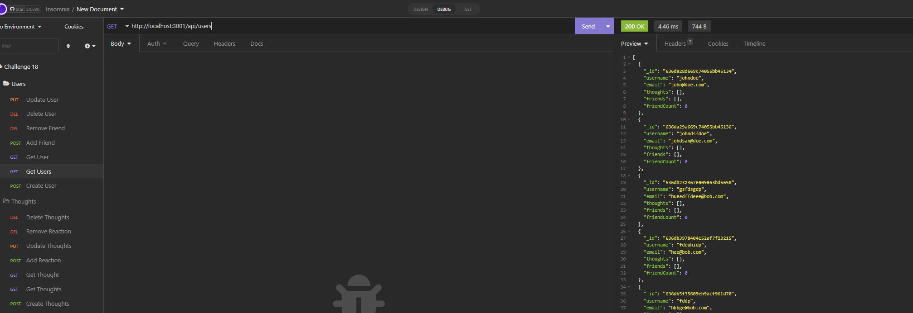
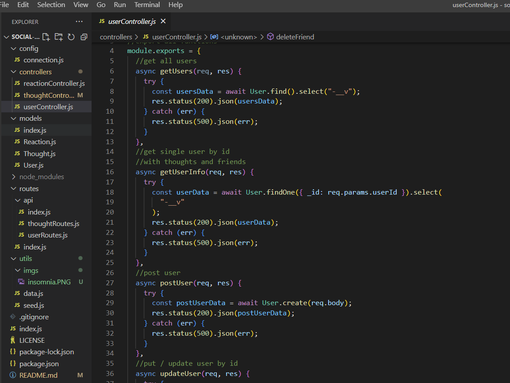

# Social Network

## Description

Social network is designed to mimic handling a large amount of data with mongo and still having an efficient back end. I utilized mogo schemas, express routes, and insomnia to confirm all work. My motivation was to see if i could take the routing knowledge from prior assignments and sucessfully implement the new mongo elements. Although i struggled with the delete functions I feel pretty good about my work. It makes connecting tables easier, more ledgible in my opinion and connecing the modles easier than ever.

## Table of Contents (Optional)

- [Installation](#installation)
- [Usage](#usage)
- [Credits](#credits)
- [License](#license)

## Installation

no install required!

## Usage

Run NPM i and node index, then launch insomnia!

watch link: https://watch.screencastify.com/v/1EyoPdbIMD9Zb4jXqiWR

## Credits

github: https://github.com/hannahhue

hannahhue : https://github.com/hannahhue/social-network

## License

MIT License

Permission is hereby granted, free of charge, to any person obtaining a copy of this software and associated documentation files (the "Software"), to deal in the Software without restriction, including without limitation the rights to use, copy, modify, merge, publish, distribute, sublicense, and/or sell copies of the Software, and to permit persons to whom the Software is furnished to do so, subject to the following conditions:

The above copyright notice and this permission notice shall be included in all copies or substantial portions of the Software.

THE SOFTWARE IS PROVIDED "AS IS", WITHOUT WARRANTY OF ANY KIND, EXPRESS OR IMPLIED, INCLUDING BUT NOT LIMITED TO THE WARRANTIES OF MERCHANTABILITY, FITNESS FOR A PARTICULAR PURPOSE AND NONINFRINGEMENT. IN NO EVENT SHALL THE AUTHORS OR COPYRIGHT HOLDERS BE LIABLE FOR ANY CLAIM, DAMAGES OR OTHER LIABILITY, WHETHER IN AN ACTION OF CONTRACT, TORT OR OTHERWISE, ARISING FROM, OUT OF OR IN CONNECTION WITH THE SOFTWARE OR THE USE OR OTHER DEALINGS IN THE SOFTWARE.
